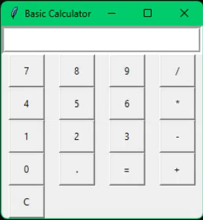

# Calculator App

A basic calculator application with a user-friendly interface for performing arithmetic operations. The calculator supports addition, subtraction, multiplication, and division operations.

## 🚀 Features

- Simple and intuitive user interface.
- Supports addition, subtraction, multiplication, and division.
- Clear button to reset the input.
- Equal button to calculate the result.

## 📷 Screenshots



## ⚡ Technologies

- Python
- Tkinter library

## 🤔 Future Improvements

The calculator app can be enhanced with additional features:
- Sound effects for button clicks.
- Highlighting the input area during and after calculations.

## 🐛 Known Issues

- None reported at the moment.

## 🚦 Running the Calculator

To run the calculator app on your local machine, follow these steps:

1. Clone the repository to your local machine.
   ```bash
   git clone https://github.com/ZohraB612/Calculator.git
   
2. Navigate to the project directory
   ```bash
   cd Calculator
   
4. Run the calculator app
   ```bash
   python calculator_app.py

## Demo

